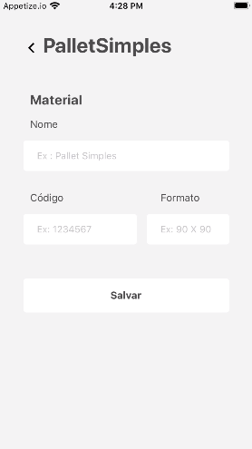
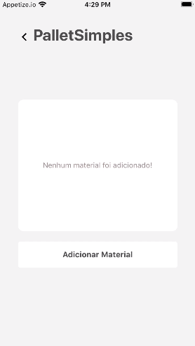

# PalletsSimples

>Status : Developing 🚧

#### It is an application whose objective is to facilitate the to-do list in the making of labels for the freeing of pallets.

### Features
- [x] Add material (pallet) offline.
- [x] View material list (pallet) offline.
- [ ] Add material online.
- [ ] View database of materials online.
- [ ] Search for registered materials.

### 🛠 Technology

The following tools were used in the construction of the project:

- [Expo](https://expo.io/)
- [Node.js](https://nodejs.org/en/)
- [React](https://pt-br.reactjs.org/)
- [React Native](https://reactnative.dev/)
- [Styled-componets](https://styled-components.com/)

### ScreenShots
<h1 align="center">
  

<h1 align="center">
  
  
  
</h1>

<h1 align="center">
  
  
</h1>

<!-- ### Create List Offline
<h1 align="center">
  
</h1>

### See List Offline
<h1 align="center">
  
</h1>

### Add materials in database Online and Offline
<h1 align="center">
  
</h1>

### See database
<h1 align="center">
  
</h1> -->
